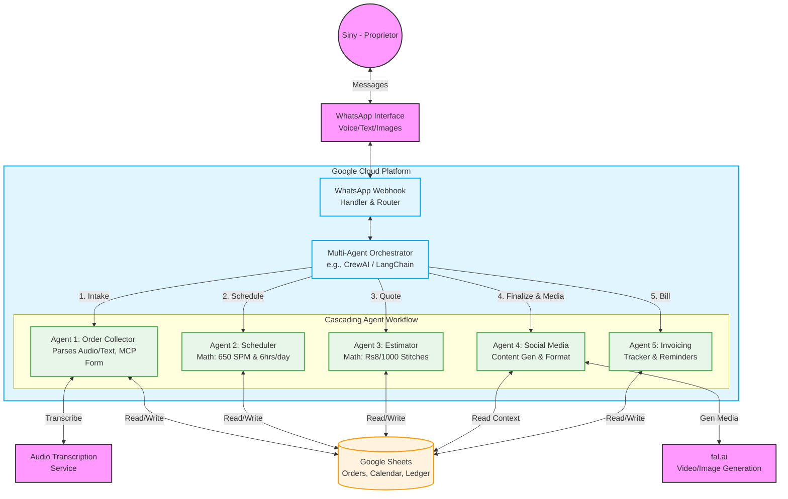

# System Architecture Diagram

```mermaid
graph TD
    %% External Interfaces
    WA[WhatsApp Interface \n Voice/Text/Images] 
    Siny((Siny - Proprietor)) <-->|Messages| WA
    
    %% GCP Infrastructure Layer - API Gateway
    subgraph GCP [Google Cloud Platform]
        Webhook[WhatsApp Webhook \n Handler & Router]
        Orchestrator[Multi-Agent Orchestrator \n e.g., CrewAI / LangChain]
        
        %% Agents
        subgraph Agents [Cascading Agent Workflow]
            A1[Agent 1: Order Collector \n Parses Audio/Text, MCP Form]
            A2[Agent 2: Scheduler \n Math: 650 SPM & 6hrs/day]
            A3[Agent 3: Estimator \n Math: Rs8/1000 Stitches]
            A4[Agent 4: Social Media \n Content Gen & Format]
            A5[Agent 5: Invoicing \n Tracker & Reminders]
        end
    end

    %% External Services
    GSheets[(Google Sheets \n Orders, Calendar, Ledger)]
    FalAI[fal.ai \n Video/Image Generation]
    Whisper[Audio Transcription \n Service]

    %% Flow
    WA <--> Webhook
    Webhook <--> Orchestrator
    
    Orchestrator -->|1. Intake| A1
    A1 <-->|Transcribe| Whisper
    A1 <-->|Read/Write| GSheets
    
    Orchestrator -->|2. Schedule| A2
    A2 <-->|Read/Write| GSheets
    
    Orchestrator -->|3. Quote| A3
    A3 <-->|Read/Write| GSheets
    
    Orchestrator -->|4. Finalize & Media| A4
    A4 <-->|Gen Media| FalAI
    A4 <-->|Read Context| GSheets
    
    Orchestrator -->|5. Bill| A5
    A5 <-->|Read/Write| GSheets
    
    %% Colors & Styling
    classDef external fill:#f9f,stroke:#333,stroke-width:2px;
    classDef gcp fill:#e1f5fe,stroke:#03a9f4,stroke-width:2px;
    classDef agents fill:#e8f5e9,stroke:#4caf50,stroke-width:2px;
    classDef db fill:#fff3e0,stroke:#ff9800,stroke-width:2px;

    class Siny,WA external;
    class GCP,Webhook,Orchestrator gcp;
    class A1,A2,A3,A4,A5 agents;
    class GSheets db;
    class FalAI,Whisper external;
```
