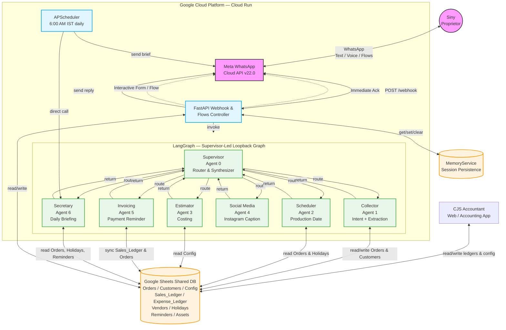

# System Architecture

> Updated: 30 March 2026 — reflects live production implementation.

## High-Level Architecture Diagram

## Key Architectural Decisions

### Supervisor-Led Loopback (not a sequential pipeline)

The graph has **no fixed sequence**. Every worker agent returns to the Supervisor after
each step. The Supervisor decides the next agent dynamically based on the current
`AgentState`. This allows:
- Re-routing if info is still missing after Collector runs
- Skipping agents that are not relevant to the current query
- Handling mixed-intent messages (e.g., "add this order AND tell me my tasks today")
- **Instant Response Routing:** If an agent sets `final_reply`, the Supervisor priorities routing to `END` immediately to deliver the message.

### `final_reply` Output Contract

All agents follow one of two patterns when writing output:

| Pattern | When | How |
|---|---|---|
| **A — Agent owns reply** | Self-contained query (Secretary, Invoicing, Social, Collector overrides) | Set `state.final_reply` |
| **B — Intermediate step** | Feeds data to next agent (Collector→order, Scheduler, Estimator) | Append to `state.aggregated_reasoning` only |

At `END`, the Supervisor checks:
- `final_reply` is set → sends verbatim (zero extra LLM call)
- `final_reply` is None → synthesizes one message from `aggregated_reasoning`

### Daily Briefing (Scheduled)

`APScheduler` inside the FastAPI process fires `SecretaryAgent.generate_daily_summary()`
at **6:00 AM IST** and sends the result directly to Siny via WhatsApp — bypassing the
LangGraph entirely. Also available via `GET /trigger-daily-brief`.
