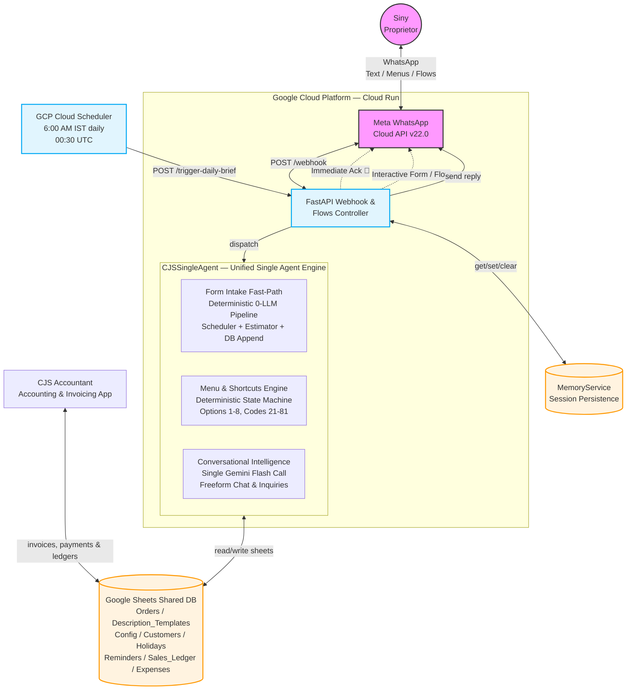

# System Architecture
## CJS Designs — AI-Powered WhatsApp Order Management System

> Updated: September 2026 — Single Unified Agent Architecture (`CJSSingleAgent`).

## High-Level Architecture Diagram

## Key Architectural Decisions

### 1. Supervisor-Led Loopback
The graph uses a dynamic loopback topology where every worker agent reports back to the Supervisor (Agent 0). The Supervisor dynamically evaluates `AgentState` to determine next steps, allowing:
- Deterministic fast-path bypass for menus and WhatsApp form submissions.
- Seamless multi-agent chaining (`Collector` &rarr; `Scheduler` &rarr; `Estimator` &rarr; `Supervisor` &rarr; `END`).
- Instant termination whenever a worker sets `state.final_reply`.

### 2. Form-Based Order Intake
Freeform message parsing for critical fields is replaced with structured **WhatsApp Flows**:
- Dropdowns for `Order Type` (from `Description_Templates` Col A) and `Template Name` (Col C).
- Numerical controls for `Quantity`, `Stitch Count` (optional), and `Labor Hours` (pre-populated default from Col E).
- Target `Expected Delivery Date` picker.

### 3. Machine Allocation & Capacity Scheduling
- Machine routing is deterministic via `Description_Templates` Col D (`Ricoma` for large garments, `Aakruthi` for small badges/logos, `None` for software-only `Embroidery design`).
- Machine running time (`stitches / 650 SPM / 60`) governs machine daily capacity and availability against the requested delivery date, skipping Sundays and studio holidays.
- Labor hours are decoupled from machine availability, measuring human design effort and driving labor cost.

### 4. Strict 4-Factor Costing
Dynamic formula reading rates from `Config`:
$$\text{Total Cost} = (\text{Stitch Cost} + \text{Labor Cost} + \text{Profit Margin}) + \text{GST}$$

### 5. Daily Briefing via GCP Cloud Scheduler
Because Google Cloud Run scales to zero during inactivity, in-process schedulers (like APScheduler) cannot guarantee morning execution. Briefings are triggered by an external **GCP Cloud Scheduler** cron job at 6:00 AM IST daily calling `POST /trigger-daily-brief`.

### 6. CJS Accountant Delineation
The AI Agent operates strictly as an executive operational assistant. Tax invoicing, payment receipts, and formal ledger mutations are managed by **CJS Accountant**; the AI Agent provides Siny with operational summaries (pending invoicing, customer payment follow-ups).
